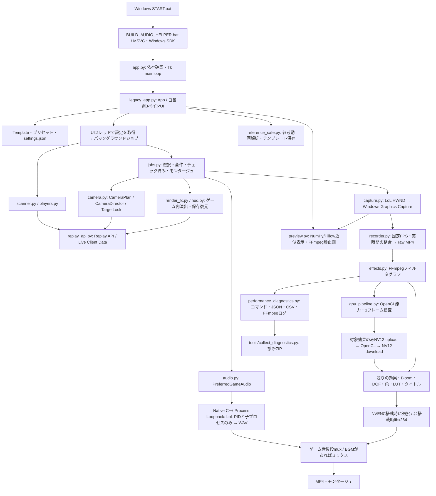

# LoL AutoCine v5.8.5 構造監査

監査日: 2026-10-08。`AGENTS.md`、`CODEX_HANDOFF_JA.md`、`CODEX_FIRST_TASK_JA.md`を読み、同梱ソースと照合した。アプリの実装、既存UI、カメラ、音声処理、依存宣言、既存テストは変更していない。

## 起動と処理の流れ

## 実装の担当と境界

| 領域 | 主なファイル | 監査結果 |
|---|---|---|
| 起動 | `app.py`, `START.bat` | 実体は`legacy_app.App`。`ui_phase1_prototype.py`は通常の起動経路ではない。 |
| UI | `legacy_app.py` | 三ペイン、プレビュー、編集コントロール、シーン一覧、参考動画、進捗・キャンセル。`_run_bg`とキュー、`_pump`でUIへ結果配送。 |
| チェック済み出力 | `legacy_app.py:1213`, `:1246`, `:1287` | `on_make_checked`がUIスレッドでTemplate/モンタージュ設定を取得し、`_make_list`へ渡す。busyをスレッド起動前に設定する。 |
| LoL設定・起動 | `core/paths.py`, `core/launcher.py` | Windowsレジストリ、game.cfg、.rofl、LCU。Linuxでは実LoLの確認対象にしない。 |
| 対象・イベント | `core/players.py`, `core/scanner.py`, `core/replay_api.py` | プレイヤー名正規化、キル/アシスト走査、重複除去、連続キルのグルーピング。HTTPモックで検証可能。 |
| カメラ | `core/camera.py` | `RigInfo`、`CameraPlan`、`CameraDirector`、対象へのアタッチと安全な俯瞰フォールバック。三人称とOrbitの座標系は変更していない。 |
| 映像入力 | `core/capture.py` | HWNDを特定するWGC。デスクトップ全体へのフォールバックなし。テスト用`SyntheticSource`は別経路。 |
| 録画 | `core/recorder.py` | 最新BGRAフレームを一定FPSでFFmpegへ送る。1080p、録画実時間との整合、失敗の伝達。 |
| ジョブ | `core/jobs.py` | 毎クリップ対象固定、録画・音声・カメラを協調、停止/再生停滞検知、素材保持、モンタージュ失敗時も成功クリップ保持。 |
| 映像効果 | `core/effects.py`, `core/gpu_pipeline.py` | 能力検査→対象GPU効果→CPUグラフ→エンコード。GPUレンダー失敗・色保持の再試行あり。 |
| ゲーム内演出 | `core/render_fx.py`, `core/hud.py` | Replay APIへFog/DOF/HUD設定を送って復元する。古い安全モードの説明と現在のHUD実装は一致しない。 |
| 音声 | `core/audio.py`, `tools/native_audio/lol_audio_helper.cpp` | 現行標準はNative Process Loopback。`PreferredGameAudio`はHelperがない/PIDがない場合に失敗し、全体音声へ切り替えない。 |
| 旧音声経路 | `core/procloop.py`, `core/audio_worker.py`, `LoopbackAudio` | ctypesや全体Loopbackの古い補助実装も残る。現行GUIの標準録音経路とは分けて理解する。削除していない。 |
| プレビュー | `core/preview.py` | UIはCPUのNumPy/Pillow合成。`render_exact_still`はFFmpegを使うがGPU前段の`gpu_prefix`は使用しない。 |
| 参考動画 | `core/reference_safe.py`, `legacy_app.py` | ローカル動画の画像特徴解析、テンプレート保存、派生。URL取得はyt-dlp。今回インターネット動画の取得は検証していない。 |
| 診断 | `core/performance_diagnostics.py`, `core/audio_log.py`, `tools/collect_diagnostics.py` | レンダー試行ごとにJSON/CSV/コマンドログ。CPU指標はマシン全体、GPU指標はnvidia-smiのデバイス全体で、LoLや他プロセスも含む。 |

## 不変条件と次の回帰確認

- 三人称斜め後ろ、ブルー/レッドサイド、Orbitの対象固定を維持。既存Orbitテストは0/+90/-90度のみで、180/270度・移動中の対象維持は今後の追加対象。
- LoLのみの音声はNative Helperの`PROCESS_LOOPBACK_MODE_INCLUDE_TARGET_PROCESS_TREE`。音声WAVがない場合を成功扱いしない。古い`audio.py`の冒頭説明は現行標準経路を表していない。
- Tkinterの読み取り・更新はUIスレッドで行う。チェック済み経路以外の各バックグラウンドハンドラーにも同じ確認を広げる。
- `capture_fps`と出力`fps`は別の設定。現行デフォルトは144/60。CPUクラウドでの処理時間をGTX 1070 Tiの速度と比較しない。
- `scale_cuda,hwdownload,format=yuv420p`の過去の失敗経路は復活させない。
- 色、実時間/音声同期、HUD復元、チェック済み1/2シーン、二重実行防止、キャンセル、モンタージュ失敗時の素材保持を優先する。

## 依存関係とクラウドの範囲

Linuxで準備したのはPython 3.12.14、NumPy、Pillow、imageio-ffmpeg、psutil、yt-dlp、pytest、ワークスペース内Xvfb。Windows専用マーカーの`windows-capture`、`pycaw`、`PyAudioWPatch`はLinuxではインストール対象外。Native HelperにはWindows 10 build 20348以上、対応Windows SDK、MSVCが必要。

requirementsにはロックファイルがなく下限指定のみ。`yt-dlp>=2026.09.01`を満たす安定版が利用できず、公式PyPIの`2026.9.27.232945.dev0`を明示導入して現行指定を満たした。依存ファイルを書き換えず、導入バージョンは環境設定と作業記録に保存。参考動画URL取得の実機動作は別途確認する。

このクラウドにはLoL、Windows API、NVIDIA GPU/OpenCLデバイスがない。モック・合成素材・Xvfbのテストは実機録画の代替確認ではない。Windowsの起動バッチやNative Helperビルドの成功は未検証。
