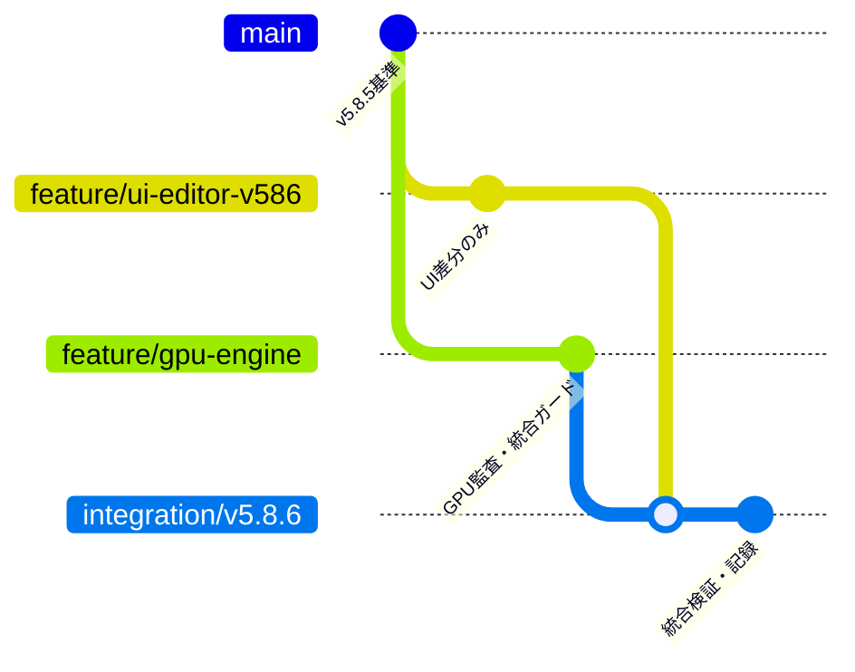

# v5.8.6 UI統合・並行開発の記録

更新: 2026-10-08。`CODEX_INTEGRATION_CONTRACT_JA.md`を読み、v5.8.5の現状監査を保存したうえでUI側の変更のみを統合した。

## 統合結果

- Full ZIPとMergeFiles ZIPのUI対象8ファイルはバイト単位で完全一致。
- Full ZIPの既存ファイル差分は`legacy_app.py`と`VERSION.txt`のみ。`core/`、`app.py`、依存宣言は元v5.8.5と一致。
- MergeFilesの8ファイルとFullのVERSION表記だけをUIブランチへ取り込んだ。Full ZIPを作業フォルダへ上書き展開していない。
- Fullに含まれたpytestキャッシュ、文字化けした旧文書の別名コピーは取り込まなかった。元の文書と診断ファイルを削除していない。
- GPUブランチを起点にUIブランチを通常のGit mergeで統合。GPU、エンコード、LoL音声、カメラ、共有APIを旧ファイルで置き換えていない。
- Codex側のGPU/エンコードの**実装改善はまだない**。今回維持したのはv5.8.5の実装とGPU原因分析。新規追加は安全な統合確認ツール、そのテスト、監査資料。

## ブランチ

| ブランチ | 用途 |
|---|---|
| `baseline/v5.8.5` / `stable/v5.8.5` | 元ZIPの不変基準。基準コミット`96b928a`。 |
| `codex/initial-audit` | v5.8.5の構成・テスト・GPU原因分析。 |
| `feature/gpu-engine` | Codex担当。GPU/エンコード側開発、統合ガード。UIは未取り込み。 |
| `feature/ui-editor-v586` | ChatGPT側のUI差分9ファイル。取り込みコミット`5a929ee`。 |
| `integration/v5.8.6` | 両ブランチを統合した開発・確認用。今回の最終checkout。 |



図のmainは共通のv5.8.5基準を模式的に示す。実際のブランチ名は上表を参照。Git履歴の各mergeに両親コミットが残り、統合の追跡とロールバックが可能。

## 競合検知ツール

追加ファイル: `tools/check_parallel_integration.py`、`tests/test_parallel_integration.py`。

マージ前:

```bash
git status --short
.venv/bin/python tools/check_parallel_integration.py
```

マージ後:

```bash
.venv/bin/python tools/check_parallel_integration.py --integration integration/v5.8.6
```

WindowsではPythonを`.venv\Scripts\python.exe`へ置き換える。Git 2.38以上の`merge-tree --write-tree`が必要。検査はcheckout、index、branch refを変更せず、Gitオブジェクトのみ生成する。

ツールは共通基準の祖先関係を検証し、次をJSONで報告する。

- UIブランチがGPU/エンコード担当ファイルを変更した場合。
- GPUブランチがUI担当ファイルを変更した場合。
- 共有APIや担当未定の実装ファイルを変更した場合。機械的に安全とせず、共同レビュー対象として止める。
- 両ブランチが同じファイルを変更した場合。行単位の自動マージが可能でもレビューを求める。
- Gitの実際のテキストコンフリクト。
- `--integration`指定時、統合先のGPU/UI担当ファイルがそれぞれの最新担当ブランチと異なる場合。旧GPUファイルへの巻き戻し、UI取り込み漏れ、ファイル削除やモード変更も検出する。

終了0は問題なし、1は競合/担当境界/共同レビューが必要、2は基準やGit機能を検証できない場合。未コミットの差分は検査対象外なので、先に`git status`を必ず確認する。ガードを迂回して片側ファイルを丸ごと採用しない。共有ファイルの変更が必要になったら契約をレビューしてから進める。

今回の実ブランチは問題なし、担当外変更/共有API変更/同時変更/実Git競合なし、統合先GPU/UIの不一致なし。

## 検証結果

- 全43 Pythonファイルの構文チェック成功。
- UI契約、既存機能保存、Orbit、モンタージュ安全性、音声/効果互換、統合ガードをXvfb下で実行。最終実行結果は21件成功・失敗/skipなし。
- `tests/test_checked_dispatch.py`成功。チェック済み2件の配送、段階ログ、busy/二重起動防止を維持。出力処理は既存のスタブであり、Windows実機録画ではない。
- 統合ガードの7ケース成功。正常な独立変更、UIからGPUへの担当外変更、GPUからUIへの担当外変更、共有API変更、実際のGitコンフリクト、無関係な基準、統合後のGPU巻き戻しを実Git履歴で検証。
- `git diff feature/gpu-engine -- core app.py requirements.txt`は空。主要GPU/録画/音声/カメラ/ジョブをバイト単位でも確認。
- インストール手順を統合版でも再実行し、依存・構文・Tk/Xvfbの準備が成功。

v5.8.5で実行済みの総合runnerは16件中11成功/5失敗で、全テスト成功とはしていない。WAVを供給しない古いテスト条件、低解像度静止画と1080p固定Bloomの寸法不一致、GUI通し試験のCPU環境240秒制限を記録済み。今回そこに関わるコア/既存テストは変更していないため、同じ高負荷総合試験を繰り返さず、変更したUI境界と統合ガードの回帰を実施した。詳細は`CODEX_AUDIT_RESULTS_JA.md`。

Windows/LoL/GTX 1070 Tiでの1クリップ・選択2シーン・色・LoL専用音声・NVENC・GPUフィルター実行は未検証。実機用コマンドは`CODEX_GPU_ANALYSIS_JA.md`、ローカル準備は`CODEX_LOCAL_DEVELOPMENT_JA.md`を参照する。

## 次の並行開発

1. Codexは`feature/gpu-engine`でGPU診断/エンコード修正を小差分で行う。`legacy_app.py`のUIレイアウト/変数は直接変更しない。新たなPublic Contract変更は実装前に提案・レビューする。
2. ChatGPT側の次回UI ZIPは`feature/ui-editor-v586`上で、前のUI状態との差分として取り込む。GPUコアを含むFull ZIPをそのまま上書きしない。
3. 双方がコミットしたらマージ前ガードを実行。問題があれば差分を確認する。`integration/v5.8.6`へそれぞれをmergeし、マージ後ガードとUI/GPUの対象テストを実行する。
4. 統合ブランチのWindows実機結果を担当ブランチへフィードバックする。担当ブランチへ相手の全コードを取り込むと所有者検査が止まるので、共通基準更新は両者のレビュー後に別途行う。

初回のCodex優先作業はNVENC搭載/実行可否の区別、OpenCLデバイス・失敗理由の診断、CPU再試行のログ整合性。GPUフィルター搭載やNVENC成功だけをGPU効果成功と表示しない。Bloom/DOFのGPU化は実機経路確認の後に個別で行う。

## 手元への持ち出し

成果物ZIPには最終ソース/監査文書と全ブランチを保持する`LoL_AutoCine.bundle`を含める。診断ログ、録画、WAV、exe、.venv、pytestキャッシュは含めない。

```powershell
git clone --branch integration/v5.8.6 .\LoL_AutoCine.bundle .\LoL_AutoCine_local
Set-Location .\LoL_AutoCine_local
git branch stable/v5.8.5 origin/stable/v5.8.5
git branch feature/gpu-engine origin/feature/gpu-engine
git branch feature/ui-editor-v586 origin/feature/ui-editor-v586
git status
```

GitHubへのpushはしていない。bundleからのローカルcloneと全枝/ファイルの一致は検証している。クラウドドラフトの保存・公開・新規タスクでの復元は別で、復元成功は未検証。
